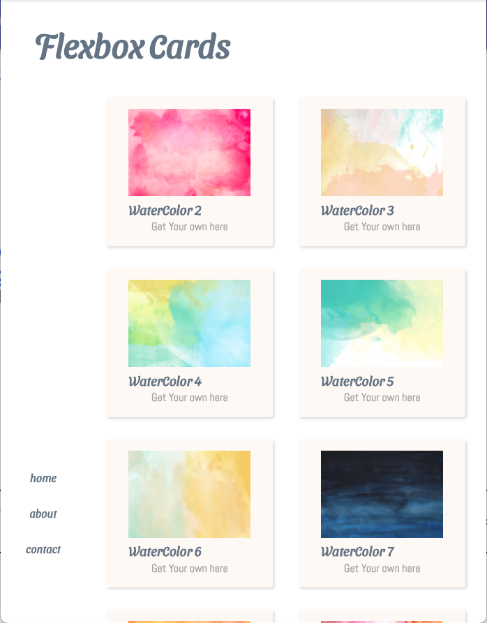
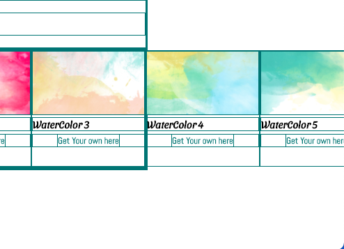
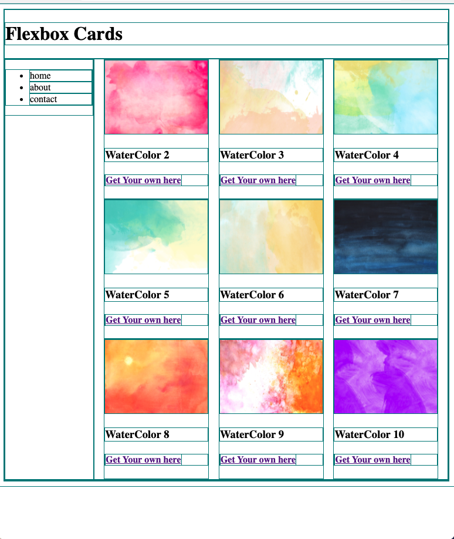

# Intro to Flexbox Code Along

Remember the Documentation:

[Flexbox was created to create a more efficient way to lay out, align and distribute space in a container - especially when the size is unknown or dynamic. - CSS Tricks](https://css-tricks.com/snippets/css/a-guide-to-flexbox/)

## What we are building

We will use flexbox to build a simple watercolor swatch site.

##### Wide view:


##### Narrow view:




## Getting Started

Let's open our code and see what is there
 - complete `index.html`
  - Web page structure:

  - all elements are wrapped in a div with a class of wrapper.
  -  Within the wrapper:
   - h1 tag
   - main with a class of container
    - main has two elements
      - aside (that has a navigation and unordered list)
      - section (that contains our 'cards')

 - `code-along.css` : this is where we will do all our work


Firstly, the images are massive. Let's write a temporary rule to keep them small

```css
img {
  max-width: 175px;
  height: 125px;
}
```

Note: the `nav` display is set to `none`. We are going to style it later, so we can just hide it for now.

Add a universal rule to draw a gold (easier to remember 1px solid gold) or teal (easier to see) border around every element.

```css
* {
  border: 1px solid teal;
}
```

Our page should look (more or less) like this. There might be some minor differences based on your browser & size of your browser.


For now, our navigation has a display none, so we can focus styling our cards first.

We will see that each of our `cards` that has an image, an h3 tag and an anchor tag inside an h4 tag and they are block elements.

There are two styling elements in flex - parents and containers

Unlike other CSS declarations, display flex only targets the immediate children

### Setting a Flex Container

```css
section  {
  display:flex;
}
```

We now have all of our cards as flex items, but they extend past their container.



Let's add a declaration so that the items wrap to the next line

```css
section  {
  display:flex;
  flex-wrap: wrap;
}

```


**Note**: different amounts of cards may be on each row, depending on the width of your browser

### Justify Content

How do we space out our cards evenly?

We can justify the content and there are a few options - let's try a few


```css
section  {
  display:flex;
  flex-wrap: wrap;
  justify-content: center;
}

```

Once we are done trying out a few options, let's add and keep `space-evenly`
```css
section  {
  display: flex;
  flex-wrap: wrap;
  /* justify-content: center; */
  /* justify-content: space-around; */
  /* justify-content: space-between; */
  justify-content: space-evenly;
}

```

### Now let's work on setting up our navigation

Comment out `display:none` on the `nav` element.

Let's make the parent container that holds our `main` and `aside` display flex:

```CSS
.container {
  display: flex;
  justify-content: space-around;
}
```

Very little space is given to our nav/aside; So let's make the aside be 20%

```CSS
aside {
  min-width: 20%;
}
```


##### Progress Check



### Let's vertically center our nav

Make aside flex container
```CSS
aside {
  min-width: 20%;
  display: flex;
}
```

and let's center that nav!

``` CSS
aside {
  min-width: 20%;
  display: flex;
  align-items:center;
  justify-content: center;
}
```

Let's polish our site a little more. Sometimes a bit of polishing helps us visually understand what is going on:

Comment out our border rule, and go into the `index.html` and link our `main.css`

[Further, flexsporer](https://bennettfeely.com/flexplorer/)
[Flexbox Froggy](https://flexboxfroggy.com/)
